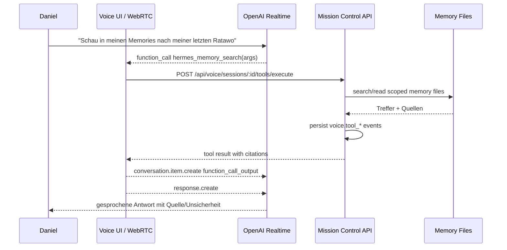

# Mission Control Voice: Realtime Tools Plan

Stand: 2026-05-06

## Ziel

Die Voice Route soll sich wie ein verlaengerter Hermes-Telegram-Chat anfuehlen: Daniel spricht live mit Hermes per OpenAI Realtime WebRTC, kann waehrend des Gespraechs explizit Memories abfragen oder Hermes kurz "recherchieren" lassen, und Hermes kommt im selben Call mit belegbaren Ergebnissen zurueck.

Der wichtigste Produktstandard: Keine erfundenen Antworten. Wenn Hermes nichts findet, sagt er das klar und nennt, wo gesucht wurde.

## Ist-Zustand

- WebRTC Realtime ist aktiv und nutzt den Browser-DataChannel `oai-events`.
- Die Realtime Session wird serverseitig in `lib/voice/realtime.ts` mit Hermes-Instructions, Channel-Kontext und kompakter Session-Hydration erzeugt.
- Der Client in `components/voice/voice-console.tsx` verarbeitet aktuell Audio-/Transcript-Events und sendet `response.create`, aber noch keine Tool-Call-Schleife.
- User- und Assistant-Transkripte werden ueber `/api/voice/sessions/[id]/realtime-turn` in Voice Turns persistiert.
- Beim Beenden schreibt `/api/voice/sessions/[id]/memory-summary` einen `VOICE_CALL_MEMORY_V1` Eintrag in die Daily Memory.
- Memory-Zugriff existiert in `lib/fs.ts` ueber `listMemoryByCategory()`, `readMemoryFile()` und Diagnostics.
- Telegram-Handoff Phase 1 existiert: `/api/voice/handoffs/telegram`, Mapping-Tabelle und hydratisierter Start. Der automatische Telegram-Gateway-Trigger und vollstaendige Thread-History-Sync sind noch nicht Teil dieser Iteration.

## Was Fuer Die Umsetzung Gebraucht Wird

- Offizielle OpenAI Realtime Tool-Calling Event-Kontrakte:
  - Session-Parameter fuer `tools` und `tool_choice`.
  - Events fuer Function Calls, Function-Call-Argumente, Function-Call-Output und anschliessendes `response.create`.
  - Verhalten bei Audio-Response waehrend ein Tool laeuft.
- Bestehende lokale Voice-Vertraege:
  - `lib/voice/types.ts`
  - `lib/voice/realtime.ts`
  - `components/voice/voice-console.tsx`
  - `lib/voice/service.ts`
  - `lib/voice/session-store.ts`
- Memory-Struktur im Deploy:
  - `/data/memory-sync`
  - Kategorien `daily`, `projects`, `core`
  - Marker `VOICE_CALL_MEMORY_V1`
- Entscheidung zum Research-Provider:
  - Iteration 1: nur lokale Memories und Mission-Control-Daten.
  - Iteration 2: interne Recherche ueber weitere lokale Quellen wie Briefings, Accounts, Tasks, Kalender.
  - Iteration 3: optional Web-Research, falls ein stabiler Provider/API-Key und Kostenrahmen festgelegt sind.

## Architektur-Vorschlag

## Tool-MVP

### `hermes_memory_search`

Zweck: Schnelle, belegbare Suche in den Memory-Dateien.

Parameter:
- `query`: Suchfrage oder Stichworte.
- `channel`: optional, Default ist aktueller Voice-Channel.
- `timeRange`: optional, z. B. `today`, `yesterday`, `last_7_days`, `all`.
- `includeVoiceCalls`: optional, Default `true`.

Rueckgabe:
- `answerable`: boolean.
- `summary`: knappe Ergebniszusammenfassung.
- `sources`: Liste aus `{ path, modified, category, excerpt }`.
- `searched`: Liste der beruecksichtigten Kategorien/Dateien.

Regel:
- Wenn keine Quelle gefunden wurde, liefert das Tool ein klares `answerable: false`; Hermes darf dann nichts erfinden.

### `hermes_memory_read`

Zweck: Eine konkrete Memory-Datei oder einen Voice-Call-Eintrag genauer lesen.

Parameter:
- `path`: logischer Pfad wie `mem:2026-05-05.md` oder `proj:sales/2026-04-28.md`.
- `focus`: optionaler Fokus fuer Extraktion.

Rueckgabe:
- relevante Ausschnitte plus Metadaten.

### `hermes_research`

Zweck: Eine explizite "geh das mal researchen"-Anfrage als laenger laufende Aufgabe behandeln.

Iteration 1:
- ruft intern `hermes_memory_search` und spaeter lokale Mission-Control-Quellen auf.

Iteration 2:
- kann mehrere lokale Quellen aggregieren.

Iteration 3:
- optional Web-Research, falls freigegeben.

Rueckgabe:
- `status`: `complete`, `partial` oder `not_found`.
- `briefing`: sprechbare Kurzfassung.
- `sources`: Quellenliste.
- `followUps`: offene Punkte.

## Iterationen

### Iteration 0: Vertraege Verifizieren

- Offizielle OpenAI Realtime Tool-Calling Docs pruefen.
- Exakte Eventnamen fuer Function Calls und Function Outputs bestaetigen.
- Bestehenden Client-Flow in `voice-console.tsx` gegen diese Events mappen.
- Akzeptanz: Ein technischer Mini-Plan mit finalen Eventnamen ist im PR/Commit dokumentiert.

### Iteration 1: Memory Tool Backend

- Neue serverseitige Tool-Registry fuer Voice anlegen, z. B. `lib/voice/tools.ts`.
- Memory-Suchfunktion bauen, die sichere logische Pfade aus `lib/fs.ts` nutzt.
- Neue API-Route bauen, z. B. `/api/voice/sessions/[id]/tools/execute`.
- Tool-Calls als Voice Events persistieren:
  - `voice.tool_call_started`
  - `voice.tool_call_completed`
  - `voice.tool_call_failed`
- Tests fuer Memory-Suche, keine Treffer und Channel-Scoping.
- Akzeptanz: Backend kann eine Frage wie "letzte Ratawo" gegen Memories suchen und mit Quellen antworten.

### Iteration 2: Realtime Tool Loop Im Browser

- Realtime Session in `lib/voice/realtime.ts` mit Tools ausstatten.
- `components/voice/voice-console.tsx` erkennt Function-Call Events.
- Client ruft Tool-Execute-Route auf.
- Client sendet Function-Call-Output zurueck in den OpenAI DataChannel und triggert danach `response.create`.
- UI-Status waehrenddessen: "Hermes schaut nach" oder "Hermes recherchiert".
- Akzeptanz: Daniel kann im laufenden Call eine Memory-Frage stellen und bekommt im selben Call eine gesprochene, belegte Antwort.

### Iteration 3: Anti-Halluzinations-Prompt Und Channel-Kontext

- Hermes-Instructions schaerfen:
  - Fakten aus Memories nur verwenden, wenn Tool-Quelle vorhanden ist.
  - Bei Channel-Fragen zuerst channel-scoped suchen, dann optional global.
  - Bei fehlender Quelle aktiv sagen: "Ich sehe das gerade nicht in den Memories."
- Begruessung reduzieren oder channel-spezifisch machen.
- Maennliche Stimme final pruefen; aktuell ist `cedar` gesetzt.
- Akzeptanz: Fitness/LUMA/Sales antworten nicht mehr mit erfundenen Details.

### Iteration 4: Research Mode

- `hermes_research` als orchestriertes Tool bauen.
- Erst lokale Quellen: Memories, Briefings, Accounts, Tasks, Kalender, Voice-Call-Marker.
- Optional spaeter Web-Research Provider anbinden.
- Bei langen Jobs Zwischenantwort sprechen lassen: "Ich recherchiere kurz, bin gleich wieder da."
- Akzeptanz: explizite Research-Aufgaben laufen im Call weiter und liefern ein kompaktes Ergebnis mit Quellen.

### Iteration 5: Telegram-Bruecke Und Nachlauf

- Voice Tool Results und Call-Zusammenfassung so speichern, dass Telegram sie zeitnah findet.
- Optional Handoff-Metadaten aus Telegram in Tool-Suche einbeziehen.
- Nach Call-Ende direkte Summary in Memory schreiben, nicht erst spaeter.
- Akzeptanz: Eine Stunde spaeter kann Telegram den Voice-Call und Tool-Ergebnisse referenzieren.

## Testfaelle

1. Fitness Memory:
   - Frage: "Was war meine letzte Ratawo?"
   - Erwartung: Tool-Suche laeuft. Antwort nur mit Quelle; sonst klares Nichtgefunden.

2. LUMA Kontext:
   - Frage im LUMA-Channel: "Was hatten wir gestern zur Microsoft Auth und Postmark gesagt?"
   - Erwartung: Voice-Call-Memory vom 2026-05-05 wird gefunden und zitiert.

3. Sales Support:
   - Frage: "Welche Sales-Support-Infos liegen zu meinem letzten Stand vor?"
   - Erwartung: Erst sales-spezifische Memories, dann global, mit Quellenliste.

4. Explizites Research:
   - Frage: "Geh das mal researchen und komm wieder zu mir."
   - Erwartung: Hermes signalisiert Recherche, Tool laeuft, Ergebnis kommt im selben Call zurueck.

5. Keine Quelle:
   - Frage nach einer absichtlich unbekannten Sache.
   - Erwartung: Keine Halluzination; Hermes sagt, dass er nichts Belastbares gefunden hat.

6. Nachlauf zu Telegram:
   - Nach Call-Ende im Telegram-Chat fragen: "Fass unser Voice-Gespraech gerade zusammen."
   - Erwartung: Telegram findet den frischen `VOICE_CALL_MEMORY_V1` Eintrag oder die persistierten Tool Events.

## Risiken Und Offene Fragen

- OpenAI Realtime Eventnamen muessen vor Implementierung offiziell bestaetigt werden.
- Lange Tool-Laufzeiten koennen die Live-Audio-Erfahrung stoeren; wir brauchen klare Zwischenzustaende.
- Browser-DataChannel darf nicht doppelt `response.create` senden, wenn parallel Audio-Events laufen.
- Memory-Suche muss performant genug fuer 100+ Markdown-Dateien bleiben.
- Web-Research braucht eine separate Entscheidung zu Provider, API-Key, Kosten und Datenschutz.
- Telegram kann frische Voice-Memories nur nutzen, wenn sein Retrieval diese Marker und Pfade aktiv indexiert oder live liest.

## Definition Of Done Fuer Den Ersten Bau-Schnitt

- Realtime Session enthaelt Tool-Definitionen.
- Browser verarbeitet Tool-Calls und schickt Tool-Outputs korrekt zurueck.
- Server fuehrt mindestens `hermes_memory_search` aus.
- Tool-Ergebnisse werden mit Quellen persistiert.
- Tests decken Backend-Tool-Suche und API-Route ab.
- Manueller Test im Voice-Call: LUMA-Frage vom 2026-05-05 wird korrekt beantwortet.

## Arbeitsanker

Dieses Dokument ist der operative Plan fuer die naechsten Iterationen. Vor jeder Implementierungsrunde wird hier geprueft:

- Welcher Abschnitt ist als naechstes dran?
- Welche Annahmen sind inzwischen bestaetigt?
- Welche Risiken sind erledigt oder neu entstanden?
